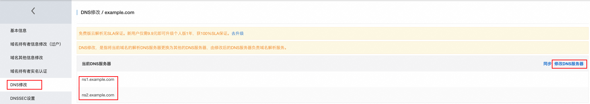

# 🧪 DNSLog 平台克隆版（自定义域名支持）

本项目是对 [dnslog.cn](https://dnslog.cn) 平台的简洁克隆，支持自定义域名部署，绕过部分安全设备对 `dnslog.cn` 的拦截。

> ✅ 适合集成在各类漏洞验证框架或红队测试中使用

---

## 🚀 特性

* 🛫️ **支持Docker快速部署**，启动即用
* 🔧 **自定义域名接入**，避免被规则识别
* 📈 **实时记录 DNS 请求信息**，包括域名、IP、时间戳
* 📊 **展示最近 5 条历史查询记录**，便于快速调试和增加容错
* 🛡️ **增强 SQLite 写入机制**，避免并发访问造成锁定
* 🗂️ **数据库自动备份机制**，保障数据完整性与可恢复性

---

## 🛠️ 环境部署（CentOS 7.9）

```bash
# 添加 EPEL 和 Remi 源
sudo yum install -y epel-release
sudo yum install -y https://rpms.remirepo.net/enterprise/remi-release-7.rpm

# 启用 PHP 7.4
sudo yum install -y yum-utils
sudo yum-config-manager --enable remi-php74

# 安装 PHP 7.4 + SQLite 支持
sudo yum install -y php74-php php74-php-cli php74-php-fpm php74-php-mbstring php74-php-opcache php74-php-sqlite3

# 启动 php-fpm 服务
sudo systemctl start php74-php-fpm
sudo systemctl enable php74-php-fpm

# 安装并启用 Nginx
sudo yum install -y nginx
sudo systemctl enable nginx
```

### 配置 PHP session 权限

```bash
vim /etc/opt/remi/php74/php.ini
# 找到并取消注释
session.save_path = "/tmp"


chmod 777 /var/www/dnslogcn/data
chmod 777 /tmp
chown -R nginx:nginx /var/lib/php/session
chmod -R 700 /var/lib/php/session
```

### 配置 Nginx 示例

```nginx
{
    listen       80;
    server_name  _;
    root         /var/www/dnslog/web;
    include /etc/nginx/default.d/*.conf;

    location ~* /(dnsServer|db)\.php$ {
        return 2;
    }

    location ~ ^/(index\.php|getdomain\.php|getrecords\.php)$ {
        include fastcgi_params;
        fastcgi_pass   127.0.0.1:9000;
        fastcgi_index  index.php;
        fastcgi_param  SCRIPT_FILENAME $document_root$fastcgi_script_name;
    }
    # 静态文件处理
    location / {
        try_files $uri @fallback;
    }

    # 当请求的 URI 不存在时，返回2错误
    location @fallback {
        return 2;
    }
}
```

---

## 🌐 域名配置说明

1. 新增A记录

   

2. 自定义dns服务器

   

3. 修改dns服务器为自定义服务器

   

---

## 📦 启动 DNS 服务

1. 编辑 `db.php`，设置你绑定的域名后缀：

```php
// Dnslog平台域名,替换 example.com 即可
$domain_suffix = getenv('DOMAIN_SUFFIX') ?: 'example.com';
```

2. 启动 DNS 服务：

```bash
php dnsServer.php &
```

3. 访问 Web 页面：

```
http://<your-server-ip>/index.php
```

---

## 🛫️ Docker 启动

`.env` 配置Web界面端口和域名:

```bash
# web服务监听端口
HTTP_PORT=8081
# 自定义的域名
DOMAIN_SUFFIX=yourdomain.test
```

docker启动

```bash
docker-compose up -d
```

---

## 📁 文件结构

```bash
.
├── data
│   ├── archive
│   │   ├── archive_create_domains_2025-06.sql
│   │   └── archive_dns_requests_2025-06.sql
│   └── domain.db
└── web
    ├── archive.php //定时归档文件，0-13点，每月归档一次
    ├── banner.png
    ├── db.php      //配置文件
    ├── dnsServer.php 
    ├── favicon.ico
    ├── getdomain.php
    └── getrecords.php
```

---

## 📝 更新日志（Changelog）

| 日期       | 更新内容                                   |
| ---------- | :----------------------------------------- |
| 2025-06-17 | ✅ Docker 快速部署 |
| 2025-06-06 | ✅ 优化 SQLite 写入机制，避免并发冲突       |
|            | ✅ 支持 DNS 查询记录展示最近 5 条           |
|  | ✅ 增加 SQLite 文件备份与数据库清理机制，减轻读写压力 |


---

## ✅ TODO

* Dns 重绑定

---

## 💡 Tips

- 理想情况下配置本地host即可替代dnslog.cn，兼容多种工具插件
- 修改index.php名称避免盗用，通过nginx配置绕过国内网站备案扫描

---

## 📬 联系反馈

如有建议或功能需求，欢迎提交 Issue 或 PR，感谢支持！
