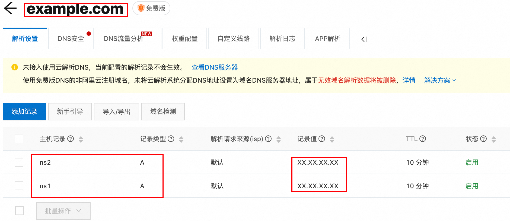
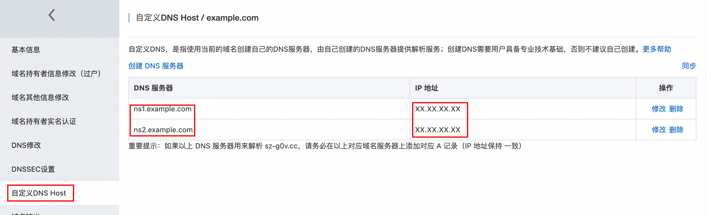
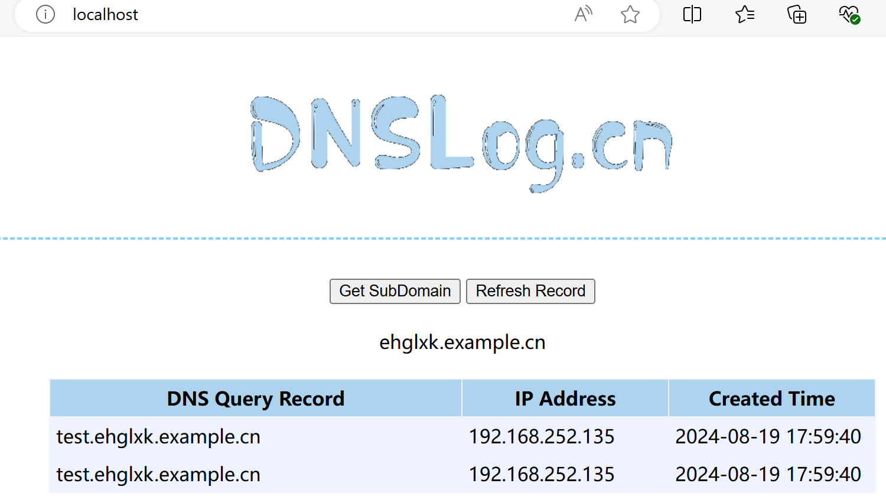

# dnslog 

Dnslog.cn 提供了一种简单的方式来创建临时的 DNS 记录，并跟踪对这些记录的查询。不过现在主流安全设备都能检测dnslog.cn的特征，但考虑到很多工具、插件集成了该dnslog平台，故此copy几行代码镜像这个dnslog平台。

## 1.准备环境 

Centos7.9 为例

```bash
# 1. 添加 EPEL 和 Remi 仓库
sudo yum install -y epel-release
sudo yum install -y https://rpms.remirepo.net/enterprise/remi-release-7.rpm
# 2. 安装并启用 Remi PHP 7.4 仓库
sudo yum install -y yum-utils
sudo yum-config-manager --enable remi-php74
# 3. 安装 PHP 7.4 和常用扩展
sudo yum install -y php74-php php74-php-cli php74-php-fpm php74-php-mbstring php74-php-opcache php74-php-sqlite3
# 4. 检查 PHP 版本
php -v
# 5. 配置 PHP-FPM（可选）配置 nginx 或 apache 使用 php-fpm 处理 PHP 请求。根据你的 Web 服务器的配置文件指引设置。
sudo systemctl start php74-php-fpm
sudo systemctl enable php74-php-fpm
# 7. 安装 nginx以及配置开机自启动
sudo yum -y install nginx
sudo systemctl enable nginx
# 配置PHP session
vim /etc/opt/remi/php74/php.ini
# 取消配置文件注释
session.save_path = "/tmp"
chmod 777 /tmp
chmod 777 /var/www/dnslogcn/data
chown -R nginx:nginx /var/lib/php/session
chmod -R 700 /var/lib/php/session

# 8. 配置 Web 服务器，如果使用 Nginx，典型的配置如下：
server {
    listen       80;
    server_name  example.com;

    root   /var/www/dnslogcn/web;
    index  index.php index.html index.htm;

    location / {
        try_files $uri $uri/ /index.php?$query_string;
    }

    # 只允许访问 getrecords.php 和 getdomain.php
    location ~ \.php$ {
            include fastcgi_params;
            fastcgi_pass   127.0.0.1:9000;
            fastcgi_index  index.php;
            fastcgi_param  SCRIPT_FILENAME $document_root$fastcgi_script_name;
        }

        include fastcgi_params;
        fastcgi_pass   127.0.0.1:9000;
        fastcgi_index  index.php;
        fastcgi_param  SCRIPT_FILENAME $document_root$fastcgi_script_name;
    }
}

# 9. 重启Web服务和PHP服务
systemctl restart nginx php74-php-fpm
```

## 2.域名配置示例

①.新增A记录



②.自定义dns服务器



③.修改dns服务器为自定义服务器


## 3.dns启动

①. 修改db.php，配置域名

```
// SQLite 数据库文件路径
$db_file = '../data/domain.db';
// Dnslog平台域名
$domain_suffix = "example.cn";
```

②. 启动DNS 服务器

```
php dnsServer.php &
```

初次运行会生成domain.db SQLite3文件，用于记录解析的dnslog域名。最终文件目录如下：

```
.
├── data
│   └── domain.db       
└── web
    ├── index.php
    ├── banner.png
    ├── db.php
    ├── dnsServer.php
    ├── favicon.ico
    ├── getdomain.php
    └── getrecords.php
```

③. 访问`http://<IP>/index.php`即可。



